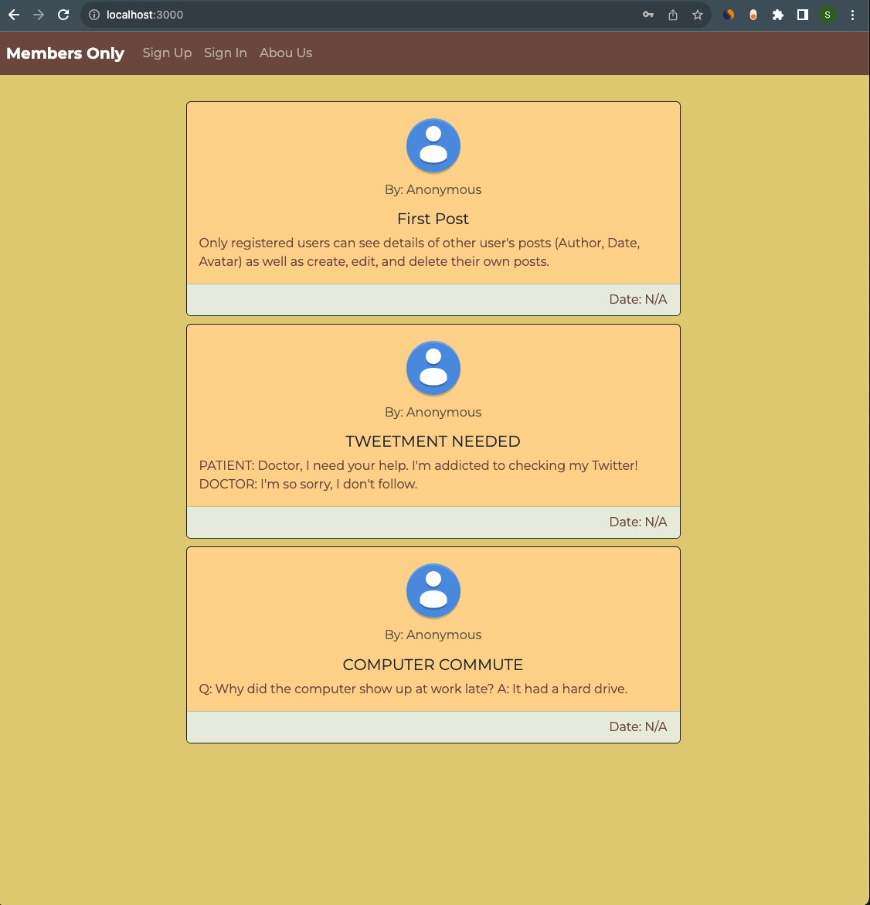
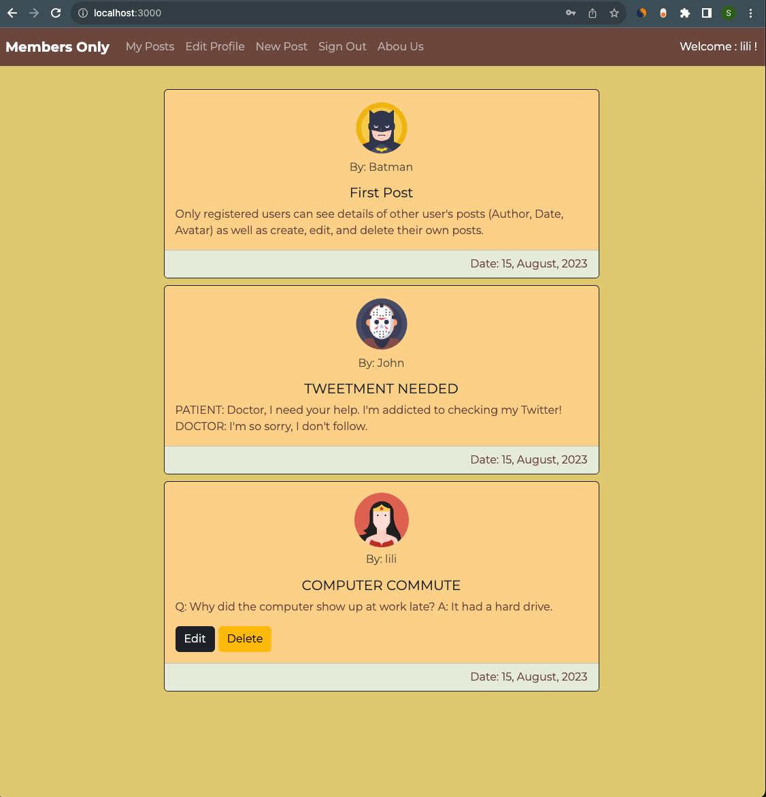
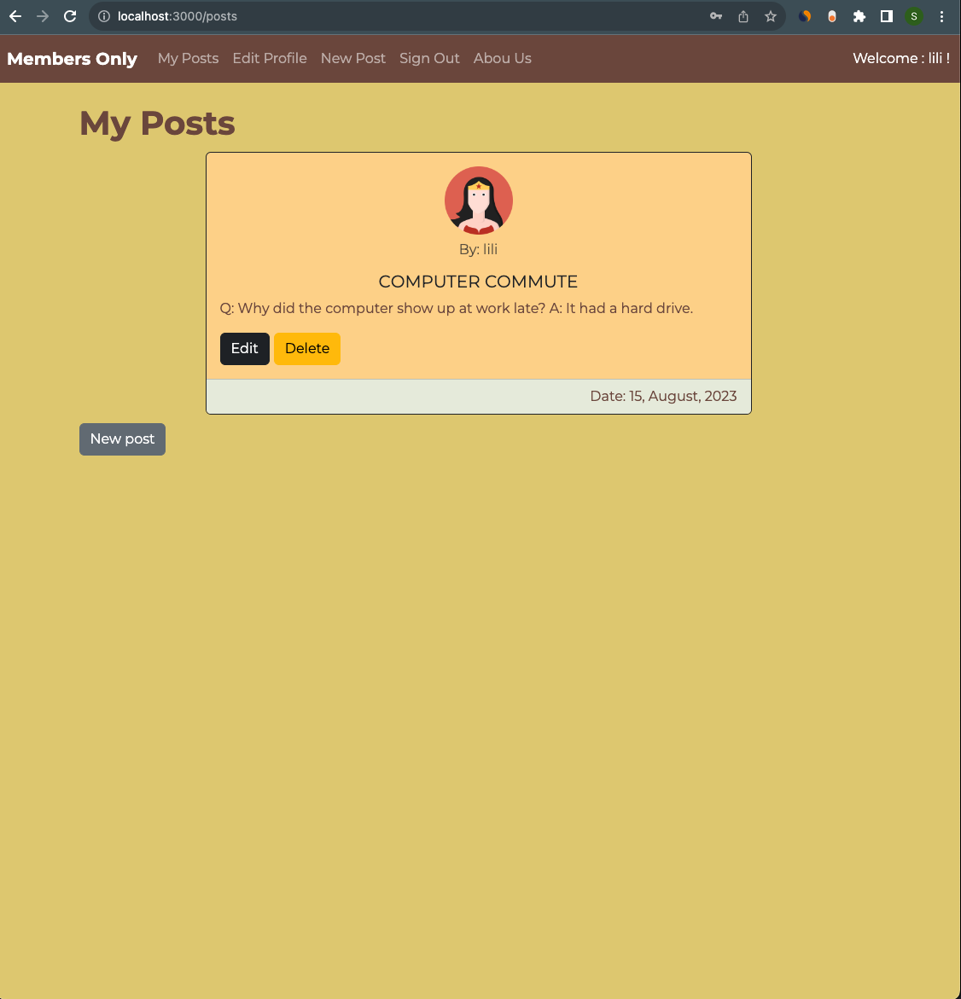
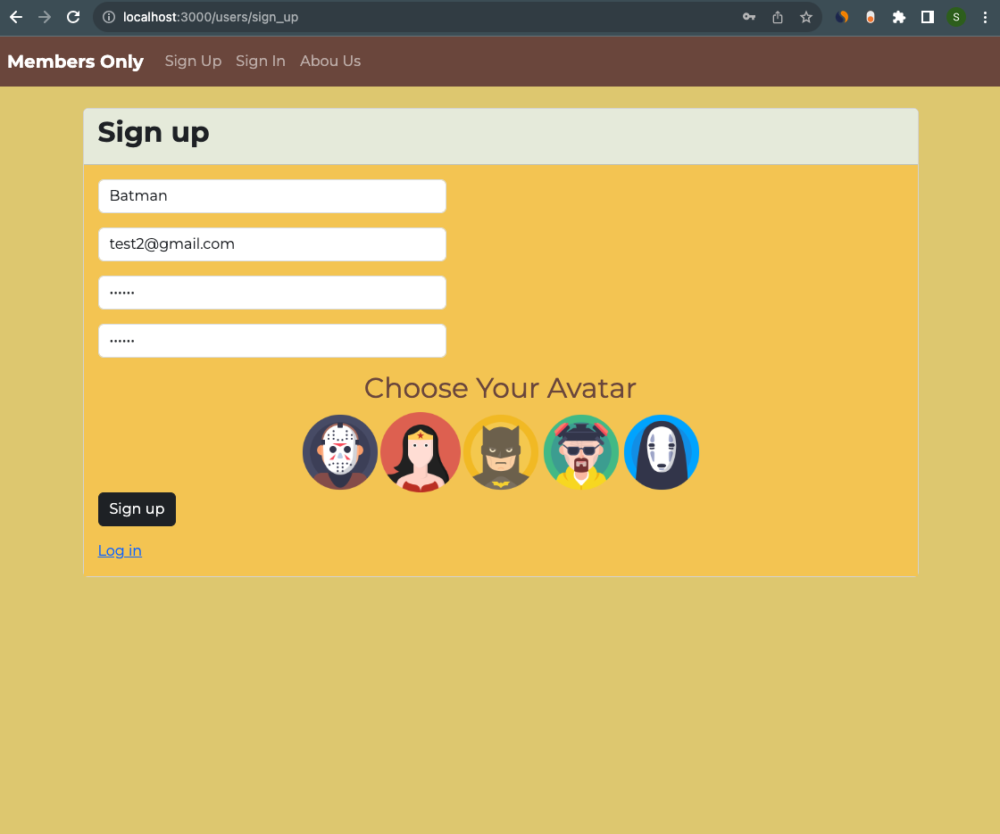

# MEMBERS ONLY

An exclusive clubhouse where members can write anonymous posts. Inside the clubhouse, members can see who the author of a post is and when it was posted, but outside they can only see the story and wonder who wrote it.

Live 👉 (please allow 30s to 40s for the server to load)

### Functionality :

Members can :

- View all posts,
- Create , edit and delete their own post,
- See the Author and the Date of others posts

Non members can:

- Only see anonymos posts

### Tech stack

- Ruby version 3.1.2
- Rails version 7.0.6
- SQLite for the database

### Homepage non-members

### Homepage for members

### Members dashboard

### Registration page

